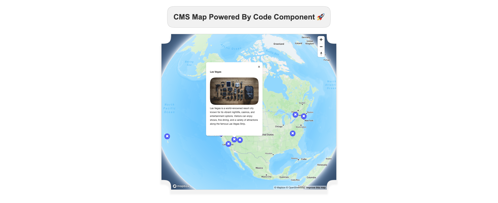

# CMS Map

This code component example integrates Mapbox with Webflow CMS collections to display dynamic location data on an interactive map. Perfect for store locators, event maps, or any location-based content.



## Features

- **CMS Collection Integration** - Automatically extracts location data from Webflow CMS Collection lists via slot-based architecture
- **Mapbox GL JS** - Powered by Mapbox for smooth, interactive maps with custom markers
- **Auto-Fit Bounds** - Automatically adjusts map view to show all markers with configurable padding and zoom limits
- **Custom Popups** - Display rich HTML content from CMS fields in map marker popups
- **Configurable Controls** - Control map center, zoom level, bounds fitting, and control positioning
- **Slot-Based Content** - Accepts any Webflow CMS collection list as a component slot for maximum flexibility
- **Vite Project Setup** - Fast development experience with Hot Module Replacement (HMR)

## Getting Started

1. Install dependencies: `npm i`
2. Create a `.env` file in the root directory with your Mapbox API key:
   ```
   VITE_MAP_KEY=your_mapbox_api_key_here
   ```
   Get your Mapbox API key from [https://account.mapbox.com/](https://account.mapbox.com/)
3. Run `npx webflow library share` to create a code library for this example in your designated Webflow workspace

## Component Properties

| Prop Name                   | Type      | Default | Description                                                  |
| --------------------------- | --------- | ------- | ------------------------------------------------------------ |
| `mapKey`                    | `Text`    | `""`    | Your Mapbox API access token                                 |
| `centerLat`                 | `Number`  | `0`     | Default latitude for map center                              |
| `centerLng`                 | `Number`  | `0`     | Default longitude for map center                             |
| `zoom`                      | `Number`  | `10`    | Default zoom level (0-22)                                    |
| `fitBounds`                 | `Boolean` | `true`  | Automatically adjust map to fit all markers                  |
| `fitBoundsPadding`          | `Number`  | `10`    | Padding around markers when auto-fitting (in pixels)         |
| `fitBoundsMaxZoom`          | `Number`  | `15`    | Maximum zoom level when auto-fitting bounds                  |
| `controlsVerticalPadding`   | `Number`  | `20`    | Top padding for map controls (in pixels)                     |
| `controlsHorizontalPadding` | `Number`  | `20`    | Right padding for map controls (in pixels)                   |
| `MarkersCollection`         | `Slot`    | -       | The slot where you place your Webflow CMS Collection List    |
| `ShowMarkersCollection`     | `Boolean` | `true`  | Toggle visibility of the CMS collection for editing purposes |

## Technical Implementation

This component showcases several advanced patterns for Webflow Code Components:

- **Custom Hook (`useCMSCollectionItems`)** - Extracts CMS list items from Webflow slots using Shadow DOM slot APIs
- **Custom Hook (`useMapbox`)** - Manages Mapbox GL JS instance lifecycle, marker creation, and bounds fitting
- **Data Attributes** - Reads `data-lat` and `data-lng` attributes from CMS items to position markers
- **Element Cloning** - Clones popup content from CMS elements to display rich HTML in map popups
- **Dynamic CSS Variables** - Uses CSS custom properties for flexible control positioning

## CMS Collection Structure

Your CMS collection should include items with the following structure:

- A wrapper element with class `marker-pin` that has `data-lat` and `data-lng` attributes
- Optional: A child element with class `maker-pop-up` containing HTML content to display in the popup

Example CMS item structure:

```html
<div class="marker-pin" data-lat="40.7128" data-lng="-74.0060">
  <div class="maker-pop-up">
    <h3>Location Name</h3>
    <p>Location description...</p>
  </div>
</div>
```
